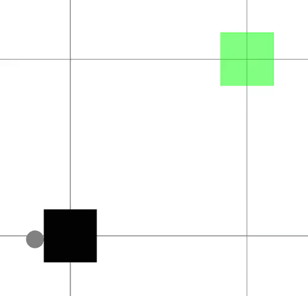

# Trajectory Optimization with Optimization-Based Dynamics 

This repository contains the implementation and examples from our paper: [Trajectory Optimization with Optimization-Based Dynamics](https://arxiv.org/abs/2109.04928).

## Installation
From the Julia REPL, type `]` to enter the Pkg REPL mode and run:
```julia
pkg> add https://github.com/thowell/optimization_dynamics
```
This will install the package.

Run 
```julia 
(OptimizationDynamics) pkg> build
```
to build the package.

[Notebooks](examples) are generated upon installation and can be run for the following examples:

## planar push
 

## hopper gait


Additional comparisons with [contact-implicit trajectory optimization](examples/comparisons/hopper.jl) are available. 
The path-following solver and hopper model can be found in [RoboDojo.jl](https://github.com/thowell/RoboDojo.jl).

## Build 
```
cd /path/to/OptimizationDynamics
julia
]
activate .
instantiate
build
```
## Run
```
julia --project=.
include("examples/planar_push.jl") # simplified model
include("examples/planar_push_complex.jl") # complex model
include("examples/line_push_fixed_box.jl")
include("examples/plot_planar_push_complex_pusher_box_force.jl")

```
## ram leak
```
ps -eo pid,tty,stat,%mem,etime,cmd | grep '[j]ulia'
pkill -9 -u "$USER" -x julia
```
